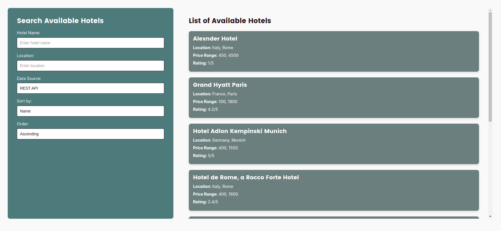

# Reisetopia Hotels Listing Plugin




This WordPress plugin allows you to fetch and display hotel data from two different APIs, with various filtering options.

## Table of Contents

- [Features](#features)
- [Installation](#installation)
- [Development](#development)
- [Building for Production](#building-for-production)

## Features

- **Fetch Hotel Data:** Retrieve hotel data from both REST and AJAX API endpoints.
- **Advanced Filtering:** Filter hotels by name, location, and maximum price.

## Installation

1. **Upload the Plugin:**
   - Generate the zip file from build process.
   - Navigate to the WordPress admin panel.
   - Go to `Plugins` > `Add New` > `Upload Plugin`.
   - Choose the downloaded zip file and click `Install Now`.
   - Activate the plugin after installation.

2. **Required Plugin:**
   - Install and activate the [Advanced Custom Fields (ACF)](https://wordpress.org/plugins/advanced-custom-fields/) plugin.

3. **Setup:**
   - Add the shortcode `[reisetopia_hotels]` to one of your pages where you want the hotels listing to appear.
   - Create and manage hotel items in the WordPress admin panel under the "Hotel" section.


## Development

To get started with development, you'll need to first WordPress development environment of your choice on your local machine. Then you need to have Node.js and npm (Node Package Manager) installed on your machine. Then:
1. Clone the repository:
    ```bash
    git clone git@github.com:mhmdsbr/reisetopia-hotels.git
    cd reisetopia-plugin
    ```
   
2. Install the dependencies:
    ```bash
    npm install
    ```


During development, you can use the following command to start a watch task that will automatically rebuild the front-end assets whenever changes are detected:
   ```bash
   npm run watch
   ```

## Building for Production

When you're ready to build the final production, for assets run:
   ```bash
   npm run build
   ```
And then run:
   ```bash
   npm run build:plugin
   ```
To generate the build directory and zip file.

Enjoy.


## Changelog

### v1.1.0 (2024-09-01)
- **Added:** Sorting feature by hotel name (ascending and descending).
- **Added:** Sorting feature by hotel minimum and maximum price (ascending and descending).

### v1.0.0 (2024-08-30)
- **Initial Release:** Fetch hotel data from REST and AJAX API endpoints.
- **Feature:** Advanced filtering by name, location, and maximum price.
- **Feature:** WordPress shortcode `[reisetopia_hotels]` for easy integration.
